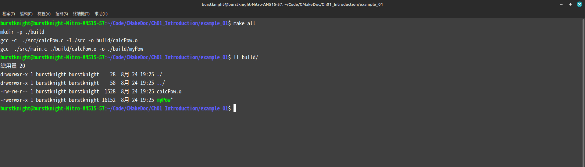

# Introduction
在本章節中會介紹什麼是`CMake`，以及一些最基本的用法。

## 什麼是`CMake`?
`CMake`是一個用來建置專案的輔助工具，功能很類似`make`。使用`CMake`建置專案時，會需要先編輯一個叫`CMakeLists.txt`的檔案，然後使用指令`cmake`來建置。如果想知道更多細節，可以看看[維基](https://zh.wikipedia.org/zh-tw/CMake)和[CMake官網](https://cmake.org/)，上面也會更詳細的資訊。

----

## 為什麼需要使用`CMake`?
### 使用指令編譯
假設有一個專案`myProject`，在這個專案中只有一個檔案`main.c`，其內容如下：
```c
#inclucde <stdio.h>

int main(){
	printf("Hello world!\n");

	return 0;
}
```
我們可以使用`gcc`下指令來編譯該專案的`main.c`:
```sh
gcc main.c -o hello
```
這個時候專案`myProject`中就會多出一個編譯後的可執行檔`hello`。

如果開發的專案裡只有兩三個檔案，使用上面說的方法下指令來建置專案可能還行。可是假如專案中的檔案一多，比方說可能有十幾個檔案好了，還用剛剛說的方法下指令來編譯專案中所有的原始碼，這段編譯的指令肯定會非常長。開發一個大型專案，這種作法是不僅很麻煩也不太可行，所以才會需要使用一些輔助工具來管理專案，把專案中的原始碼編譯成函式庫或可執行檔。

### 使用指令make編譯
`make`也是一個用於建置專案的工具，這套工具需要使用一個腳本檔案來編寫建置的規則和流程，這個腳本檔案可以命名為`makefile`或`Makefile`。為了方便說明，這裡統一使用`makefile`。只要編寫好建置規則和流程，`make`就會根據`makefile`的內容，以及專案中每個原始碼的檔案之間的相依關係，來編譯所有的原始碼。

使用`make`建置的好處是，在編譯的過程中會根據`makefile`的規則檢查哪些檔案已經修改過且需要再編譯一次，又有哪些檔案沒更動過且不需要再編一次。這對於大型專案來說，可以節省不少編譯的時間，因為只要曾編譯過一次，`make`就只會針對更改過的檔案或新增的檔案編譯，不需要對專案中所有的檔案重新編譯。

#### exmaple_01
接下來用範例來簡單說明怎麼使用`make`來建置一個專案。這邊建議是照著下面的流程玩過一遍會比較好，假如懶得做一遍，可以直接用[exmaple_01](./example1/README.md)。

請先建一個資料夾，該資料夾的名稱可以任意使用，這邊就用`exmaple_01`來命名，後面說明比較能統一。在資料夾`exmaple_01`中再建一個資料夾，請將該資料夾命名為`src`。資料夾`src`用來放所有的source code，這包含`.c`、`.cpp`、`.h`和`.hpp`這些檔案。也因為資料夾`src`主要用來放source code，所以這個資料夾也可以稱為`Source Tree`。

##### 新增標頭檔`calcPow.h`
接下來請在資料夾`src`中新增一個標頭檔`calcPow.h`，該檔案的內容如下:
```c
#ifndef CALCPOW_H
#define CALCPOW_H

/**
 * @brief Calculate pow.
 *
 * @param dX: Give a number to calculate the power.
 * @param iExp: Give the exponential.
 *
 * @return 
 */
double calcPow(double dX, int iExp);

#endif
```
在這個標頭檔中只宣告了一個函數`calcPow()`，其實這個函數就只是簡單實作數學函式`pow()`。

##### 新增檔案`calcPow.c`
請在資料夾`src`中再新增一個檔案`calcPow.c`，用來實作函數`calcPow()`，該檔案的內容如下：
```c

double calcPow(double dX, int iExp){
	double dResult = 1.0;
	int i = iExp;

	while (1) {
		if (i == 0) {
			break;
		}else if (i > 0) {
			dResult *= dX;
			i--;
		}else {
			dResult /= dX;
			i++;
		} // End of if-condition
	} // End of while-loop

	return dResult;
} // End of calcPow
 
```

##### 新增`main.c`
接下來該在資料夾`src`中新增`main.c`，這樣才能使用函數`calcPow()`，該檔案的內容如下：
```c
#include <stdio.h>
#include <stdlib.h>
#include <string.h>
#include "calcPow.h"

int main(int argc, char** argv){
	if (argc < 3) {
		printf("Usage: %s base exponential\n\tbase\t\tGive a float number as the base.\n\texponential\tGive an integer as the exponential.\n", argv[0]);
		exit(1);
	} // End of if-condition

	double dBase = atof(argv[1]);
	int iExp = atoi(argv[2]);

	printf("%.4f ^ %d = %.4f\n", dBase, iExp, calcPow(dBase, iExp));

	return 0;
} // End of main
```

##### 新增`makefile`
接下來該編輯`makefile`了。請先在目錄`exmaple_01`中新增檔案`makefile`，該檔案的內容如下:
```make
SRC_DIR := ./src
BIN_DIR := ./build
TARGET := myPow

CFLAGS := 
CC := gcc

.PHONY: all clean

all: $(BIN_DIR)/calcPow.o
	$(CC) $(CFLAGS) $(SRC_DIR)/main.c $(BIN_DIR)/calcPow.o -o $(BIN_DIR)/$(TARGET)

$(BIN_DIR)/calcPow.o:
	mkdir -p $(BIN_DIR)
	$(CC) -c $(CFLAGS) $(SRC_DIR)/calcPow.c -I$(SRC_DIR) -o $@

clean:
	rm -rf $(BIN_DIR)/*
```

這裡稍微解釋一下上面的`makefile`的內容。`makefile`中的指令也可以當作是一種程式語言，它有自己的語法。為了方便說明，上面的`makefile`的內容可以拆成兩個部分。

先從第一部分開始說起，第一部分的內容如下：
```make
SRC_DIR := ./src
BIN_DIR := ./build
TARGET := myPow

CFLAGS := 
CC := gcc
```
這部分可以看做是在宣告變數，所以這裡總共宣告了五個變數:
1. 宣告變數`SRC_DIR`，其內容為`./src`，用來設定專案`exmaple_01`中所有的source code都放在哪一個資料夾中
2. 宣告變數`BIN_DIR`，其內容為`./build`，用來指定在編譯的過程中所產生的檔案要放在哪個資料夾中
3. 宣告變數`TARGET`，其內容為`myPow`，用來指定最終會編譯出名為`myPow`的可執行檔
4. 宣告變數`CFLAGS`，用來追加編譯的參數，這個後面會解釋怎麼使用
5. 宣告變數`CC`，其內容為`gcc`，用來指定使用`gcc`來編譯程式碼
如果想取用這些變數的值，可以使用`$()`把變數包在裡面。比方說如果想取得變數`TARGET`，就可以用`$(TARGET)`來取得其值`myPow`。

在說明第二部份以前，先從怎麼在`makefile`中寫指令來編譯程式碼。在`makefile`中通常會用下面的的架構，來定義編譯的規則:
```make
<target>: <requirements>
    <command 01>
    <command 02>
    ...
    <command N>
```
接下來說明這個架構每一個意義:
* `<target>`: 它可以是一個標籤，也可以用來代表一個或一組source code編譯後的檔案名稱。
* `<requirements>`: 如果`<target>`是欲編譯的目標檔，則`<requirements>`則是用來表示編譯該目標檔所需的相依檔。假如相依檔的數量不只一個，就需要用空格隔開。
* `<command 01>`: 為了能建置專案中所有的source code，用來指定需要執行的shell指令，需要注意一點，在`<target>`底下的每行指令前面必須使用`TAB`鍵縮排才行。

第二部分的內容如下：
```make
.PHONY: all clean

all: $(BIN_DIR)/calcPow.o
	$(CC) $(CFLAGS) $(SRC_DIR)/main.c $(BIN_DIR)/calcPow.o -o $(BIN_DIR)/$(TARGET)

$(BIN_DIR)/calcPow.o:
	mkdir -p $(BIN_DIR)
	$(CC) -c $(CFLAGS) $(SRC_DIR)/calcPow.c -I$(SRC_DIR) -o $@

clean:
	rm -rf $(BIN_DIR)/*
```
接下來說明第二部分的內容。先從`.PHONY: all clean`開始說明，這一行用來告訴`make`在`makefile`中的`all`和`clean`只是標籤。`make`也可從這一行知道，使用這個`makefile`建置專案時有兩個動作可以使用:
 1. `make all`: 可以把專案`exmaple_01`建置成可執行檔`myPow`。
 2. `make clean`: 可以清除所有建置出來的檔案。

為了方便說明第二部分後面的內容，我們就透過`make`建置的流程來說明:
1. 在shell中下指令`make all`時，`make`就會執行標籤`all`這邊的指令。
2. 在執行`all`這個標籤底下的指令以前，必須先把相依檔`$(BIN_DIR)/calcPow.o`編譯出來，所以`make`就會去執行標籤`$(BIN_DIR)/calcPow.o`的指令。
3. 因為標籤`$(BIN_DIR)/calcPow.o`沒有相依檔，所以直接執行下面的兩行指令:
    1. 先建立出目錄`build`。
    2. 把資料夾`src`中的`calcPow.c`編譯成`calcPow.o`，並且把產生出來的檔案存放到目錄`build`中。
4. 因為建置成可執行檔所需的相依檔`calcPow.o`已經編譯出來，所以回到標籤`all`，繼續執行在標籤`all`下面的指令，把可執行檔`myPow`編譯出來並且存放在目錄`build`中。

在這個範例中，由於資料夾`build`專門存放建置時產生出來的檔案，所以這個資料夾也可以稱為`Binary tree`。會需要這種資料夾，可以避免建置的過程中產生過多中間檔，把整個專案搞得很亂。

##### 使用`make`建置
在編輯完`makefile`以後，就來說明如何透過`make`這個工具來建置專案。

我們先從下這個指令來建置專案`exmaple_01`:
```sh
make all
```
執行完指令以後，會發現專案中多了一個目錄`build`，而且在該目錄底下會有建置過程中產生的中間檔案，以及最終目標檔`myPow`。


其實我們也可以直接使用下面這個指令來編譯:
```sh
make
```
這個指令也同樣可以建置專案，而且執行結果與使用`make all`相同，因為`all`這個標籤在`make`中是一個特殊的標籤，它代表了預設編譯的動作。


現在我們來使用這個指令來清除目錄`build`中所有的檔案:
```sh
make clean
```
使用完這個指令以後，目錄`build`所有的檔案都會不清除掉。有時前幾次建置的中間檔可能有問題，就可以先用`make clean`把編譯出來的所有檔案都先清掉，這樣就可以重新再編譯一次。


其實還有一種情況也會使用到`make clean`，那就是在專案中的程式碼沒更動到的情況下，而且已經編譯過了，可是想再編譯一次並且追加一些編譯參數。在`gcc`這個指令中，可以加上參數`-O3`，這個時候編譯的過程中編譯器會最佳化編譯出來的檔案，使編譯出來的程式檔案更小且跑起來更快一些。假設我們的專案中有幾個bug需要修正，但我們還不知道那些bug在哪裡，這個時候就應該使用`gdb`這類的工具debug。如果要使用`gdb`，就必須再編譯時加上一個參數`-g`才行，編譯出來的檔案才會有額外的資訊方便debug。

前面說明`makefile`的時候有提到可以宣告變數，在我們使用`make`這個工具時，就可以用上這些變數在編譯時做些特別的事。剛剛我們建置的時候沒有額外加編譯參數，現在我們可以試試看加上`-g`這個參數來編譯看看。前面也有提到，在範例`exmaple_01`的`makefile`中有宣告變數`CFLAGS`，這個變數用來給予編譯參數，所以我們可以在使用`make`這個指令的同時搭配`CFLAGS`給予編譯參數。
```sh
make clean
make CFLAGS+=-g
```
等編譯完成，可執行檔`myPow`會因為包含一些除錯用的資訊，檔案可能會比較大，但是我們也可以使用`gdb`除錯。


### 使用cmake建置
前面介紹了怎麼使用`make`建置一個專案，不管專案中有多大，只要`makefile`的編譯規則寫好，都能很輕易建置專案，而且在建置的過程中只會對有更新過的檔案編譯，所以可以節省很多時間。有這麼好用的工具可以使用，為什麼還要使用`cmake`呢？那是因為`make`這個工具沒有跨平台。一般來說`make`在Unix-like的作業系統中才能使用，像是Linux。假如想在Windows中使用`make`，要嘛使用WSL要嘛使用msys2，使用上會比較麻煩。

`cmake`的優勢在於支援跨平台。假設我們在開發一個用專案，在這個專案中沒有使用到只支援特定作業系統的函式庫，像是使用到Linux的`fork()`，那麼就可以在Linux和Windows上建置這個專案。雖說`cmake`的確是一個用於建置專案的工具，但是使用上又跟`make`有點不同。當我們為一個專案編輯好`CMakeLists.txt`以後，透過`cmake`建置該專案的流程如下:
1. 先在該專案中建立一個用於建置的資料夾
2. 使用`cmake`產生建置工具所需的設定檔
3. 透過`cmake`所產生的檔案，使用建置工具來編譯專案中的原始碼
從上面的流程可以知道，`cmake`不會直接建置專案，而是先產生建置工具所需的設定檔，然後使用那些設定檔透過建置工具來編譯專案。`cmake`不直接編譯專案的程式碼，而是先產生建置工具所需的設定檔，主要是因為這樣可以支援多種建置工具來編譯專案。在Linux中`cmake`就產生`makefile`，然後使用`make`來編譯專案。在Windows上，`cmake`就產生提供給`Visual Studio`所需的檔案，讓`Visual Studio`來編譯專案。在Mac OS上，`cmake`就產生`xcode`所需的檔案，讓`xcode`來編譯專案。這樣就能達成跨平台的支援。

#### example_02
接下來用範例來簡單說明怎麼使用`cmake`。這裡直接拿`exmaple_01`改來用，請先把前一個範例`exmaple_01`複製一份，並且命名為`example_02`。因為我們接下來要使用`cmake`建置專案，所以請先把`makefile`刪除掉，然後新增檔案`CMakeLists.txt`，該檔案的內容如下：
```cmake
cmake_minimum_required(VERSION 3.0)

project(example02)

include_directories(src)

add_executable(myPow src/main.c src/calcPow.c)
```
就只是把專案`example_02`編譯成可執行檔`myPow`，假如不把空行算進去，只需要短短的4行就能做完。現在來說明每一行的意義:
* `cmake_minimum_required()`: 這行的用意是指定能使用的`cmake`最低版本。其實沒這行也可以使用，只是如果`CMakeLists.txt`有用到的指令只有在比較舊的版本才能使用，少這一行可能無法建置。
* `project()`: 這行是用來指定專案的名稱，雖然不使用不會怎麼樣，但建議使用會比較好。
* `include_directories()`: 因為標頭檔`calcPow.h`放在目錄`src`中，所以才需要這一行，告訴`cmake`這個專案的`.c`檔中所使用的標頭檔放置的路徑在哪裡。
* `add_executable()`: 這一行是關鍵，它會把在目錄`src`中的`main.c`與`calcPow.c`編譯成可執行檔`myPow`。

現在來說明怎麼使用`cmake`建置，可以先把目錄`build`中的檔案都刪掉。開啟終端機，然後使用移動到`build`中，接著使用下面的指令:
```sh
cmake ..
```
`cmake`這個指令後面必須給予一個參數，用來指定`CMakeLists.txt`所在位置，由於當前目錄在`build`中，而`CMakeLists.tx`在上一層的目錄中，所以`cmake`後面接的參數是`..`。執行結果如下圖所示。


到這邊還只是第一步，`cmake`才剛產生出`makefile`。現在使用下面的指令，透過`make`來編譯專案:
```sh
make
```
如下圖所示為執行的過程，由`cmake`產生的`makefile`非常貼心，編譯的過程中還會顯示處理的進度。


----

## 變數
在上一個小節中有提到，`cmake`是一個專門產生建置工具所需設定檔的軟體，為了能夠產生正確的檔案，就需要編輯好`CMakeLists.txt`這個檔案。就跟`makefile`類似，`CMakeLists.txt`裡面的內容也有自己獨特的語法，就像一種程式語言。這種程式語言有幾個特性:
* 每一個指令都像函數
* 每個指令沒有大小寫之分
* 可以宣告變數，但是變數有大小寫之分
* 可以使用`${}`包裹變數來取得變數的值

在`CMakeLists.txt`中也可以宣告變數，讓我們可以寫出更易讀又有彈性的`CMakeLists.txt`，也可以避免打錯字。

### set()與message()
前面提到在`CMakeLists.txt`中變數有大小寫之分，接下來實際體驗看看。這邊對應的範例是`example_03`。

先從指令`set()`說起，當一個變數不存在時，這個指令就可以用來宣告變數。假如有一個變數已經存在了，這個指令可以用來修改該變數的值。
```
set(<var> <value>)

說明:
<var>: 給予變數的名稱
<value>: 給予該變數的值
```

為了能夠在範例`example_03`中方便說明，這邊先介紹指令`message()`。這個指令的功能很類似`C`語言中的`printf()`，可以把變數和字串印出來。有時透過`cmake`建置專案時，需要顯示一些提示用的訊息，或是因某些因素導致建置失敗時也需要顯示錯誤訊息，這個時候就會用到這個指令。
```
message([<mode>] <msg> ...)

說明:
<mode>: 用來指定顯示的訊息的等級
<msg>: 給予欲顯示的資訊
```
比較值得一提的是，`<mode>`這個參數也可以不給予，但是`message()`會使用預設等級來顯示資訊。這邊列出我個人認為比較常使用的等級:
| 等級          | 說明                              
|---------------|-----------------------------------
| `STATUS`      | 這個等級通常用在顯示大部分對使用者來說感興趣的訊息
| `WARNING`     | 這個等級用來顯示警告訊息
| `FATAL_ERROR` | 使用這個等級會顯示完訊息以後，強制終止後面的指令

現在就從範例中更進一步說明怎麼使用變數，請先建出一個資料夾`example_03`，然後在這個資料夾中新增一個檔案`CMakeLists.txt`。為了方便解釋，這次會一個階段一個階段說明。請先在`CMakeLists.txt`中新增下面的內容:
```cmake
cmake_minimum_required(VERSION 3.0)
project(example03)

set(Var 2.0)
set(var 55)
set(s1 "Hello world")
```
第一行是設定最低要求的`cmake`版本，而第二行則是設定專案名稱為`example03`。這邊的重點在後面的三行:
* `set(Var 2.0)`: 由於前面沒宣告變數`Var`，所以這行指令會宣告出變數`Var`，並且將其初始化為`2.0`。
* `set(var 55)`: 這行也是宣告變數`var`，並且將其值設定為`55`。
* `set(s1 "Hello world")`: 這行也是宣告變數`s1`，並且給予一個字串。

接下來請在`CMakeLists.txt`後面新增下面的內容:
```cmake
message("====================================================")

message("var: " ${var})
message("Var: " ${Var})
message("s1: " ${s1})

set(var 88)
message("Change var: " ${var})
```
這部分的第一行就只是印出分隔符號而已，方便看後面顯示的訊息。接下來的三行就是用`message()`把前面宣告的變數印出來，可以看到只要變數宣告出來，就可以使用`${}`把變數包起來，就能取出該變數的值，像是`${var}`就能取出其值`55`。最後面的那兩行會把變數`var`的值更改為`88`，然後印出來。這邊可以驗證前面提到跟變數有關的幾件事:
* 從`var`與`Var`的值不同，可以知道在`CMakeLists.txt`中的變數有大小寫之分。
* 當變數已經宣告出來時，`set()`就只會針對給定的變數修改其值。

最後請在`CMakeLists.txt`再加上下面的內容:
```cmake
message("PROJECT_SOURCE_DIR: " ${PROJECT_SOURCE_DIR})
message("PROJECT_BINARY_DIR: " ${PROJECT_BINARY_DIR})
message("CMAKE_CURRENT_SOURCE_DIR: " ${CMAKE_CURRENT_SOURCE_DIR})
message("CMAKE_SYSTEM_PROCESSOR: " ${CMAKE_SYSTEM_PROCESSOR})
message("CMAKE_SYSTEM_NAME: " ${CMAKE_SYSTEM_NAME})

message("====================================================")
```
在這部分中最後一行也只是印出分隔符號而已。前面幾行則是顯示`cmake`所定義的變數的內容。`cmake`已經事先定義好非常多變數，有了這些變數，我們在`CMakeLists.txt`中不需要寫過多指令，`cmake`就能夠執行完整的建置過程。這邊先列出上面範例中出現的變數所代表的意義:
變數名稱                    | 說明
----------------------------|---------------------------------------------------
`PROJECT_SOURCE_DIR`        | 用來代表一個專案的根目錄
`PROJECT_BINARY_DIR`        | 用來代表執行指令`cmake`所在之目錄
`CMAKE_CURRENT_SOURCE_DIR`  | 用來代表當前處理`CMakeLists.txt`所在的路徑
`CMAKE_SYSTEM_PROCESSOR`    | 用來代表執行指令`cmake`之電腦的CPU類型
`CMAKE_SYSTEM_NAME`         | 用來表示執行指令`cmake`之電腦所使用的作業系統

下面是在範例`example_03`中的`CMakeLists.txt`完整的內容:
```cmake
cmake_minimum_required(VERSION 3.0)
project(example03)

set(Var 2.0)
set(var 55)
set(s1 "Hello world")

message("====================================================")

message("var: " ${var})
message("Var: " ${Var})
message("s1: " ${s1})

set(var 88)
message("Change var: " ${var})

message("PROJECT_SOURCE_DIR: " ${PROJECT_SOURCE_DIR})
message("PROJECT_BINARY_DIR: " ${PROJECT_BINARY_DIR})
message("CMAKE_CURRENT_SOURCE_DIR: " ${CMAKE_CURRENT_SOURCE_DIR})
message("CMAKE_SYSTEM_PROCESSOR: " ${CMAKE_SYSTEM_PROCESSOR})
message("CMAKE_SYSTEM_NAME: " ${CMAKE_SYSTEM_NAME})

message("====================================================")
```

### 列舉所有原始碼檔案: `aux_source_directory()`
這邊再介紹一個我個人認為很好用又很常用的指令，那就是`aux_source_directory()`。

在說明這個指令之前，先來想像一個情境，假設有個專案`myProject`，在這個專案中有個目錄`src`會放置所有的原始碼。假如這個專案非常大，在目錄`src`中有幾十個檔案，編輯`CMakeLists.txt`來建置這個專案時就會非常痛苦，因為要一個一個列出`.c`或`.cpp`檔，才能編譯這些檔案，而且只要一不小心很有可能打錯字。

遇到這種狀況，最好的做法是讓`cmake`自動搜尋所有的`.c`和`.cpp`檔，然後使用這些檔案來建置專案。這麼做不僅可以避免不小心打錯字，而且不管在專案中新增或移除多少個Source code，我們只需要稍微修改`CMakeLists.txt`，就能夠建置專案。

`aux_source_directory()`這個指令在前面提到的情境中非常好用。這個指令的功能是給定一個資料夾的路徑，會找出該資料夾中所有的`.c`和`cpp`檔，然後儲存進一個變數中。

現在就用範例來說明怎麼使用`aux_source_directory()`，請先建立出一個目錄`example_04`作為這次範例的專案名稱，然後在該目錄底下再建一個資料夾`src`。在資料夾`src`中放置這三個檔案:`main.c`、`calcPow.h`和`calcPow.h`，這三個檔案的內容與範例`example_02`的相同，所以也可以直接從範例`example_02`直接複製過來。

接下來說明`CMakeLists.txt`的內容，該檔案的內容如下:
```cmake
cmake_minimum_required(VERSION 3.5)
project(example02)
include_directories(src)

aux_source_directory(src SRCS)
add_executable(myPow ${SRCS})
```
前三行指令的用途還是在解釋一次:
* `cmake_minimum_required()`: 用來設定可以接受的`cmake`最低版本。
* `project()`: 用來設定專案的名稱。
* `include_directories()`: 由於目錄`src`中存在標頭檔，所以需要使用這個指令來設定`cmake`該從哪裡尋找標頭檔的位置。

在`CMakeLists.txt`中最後兩行才是重點:
* `aux_source_directory()`: 在這個指令中先給第一個參數`src`用來指定Source code所在之路徑，然後這個指令會把目錄`src`中所有的`.c`檔都找出來並且儲存在變數`SRCS`中。
* `add_executable()`: 在這個指令中可以發現原本`myPow`後面要列出所有`.c`檔，但現在使用`aux_source_directory()`自動搜尋在目錄`src`中的`.c`檔，然後我們可以把`${SRCS}`塞到`add_executable()`後面，因為`SRCS`這個變數就代表所有的`.c`檔。

現在我們有了`CMakeLists.txt`，接下來試試看建置專案。請先使用下面的指令建立目錄`build`，然後進入該目錄中:
```sh
mkdir build
cd build
```
然後我們需要使用下面的指令來建置專案:
```sh
cmake ..
make
```

這次我們修改`CMakeLists.txt`，我們使用`aux_source_directory()`來自動搜尋在目錄`src`中所有的`.c`檔，而且我們有同樣可以建置專案。

----

## if條件判斷
在`CMakeLists.txt`中也可以像`C/C++`一樣使用if條件判斷，根據建置的一些設定來做些複雜的事情。在`cmake`中if條件判斷的語法如下:
```cmake
if(<condition>)
    <command>
endif()
```
用法跟`C/C++`類似，在`if()`中給予判斷式子，也就是`<condition`。而`<command>`就是在條件判斷成立，所執行的指令。基本上`if()`後面必須接上`endif()`，`cmake`在執行時才會知道`if`條件判斷的區塊範圍在哪裡。

現在就用範例來簡單說明怎麼使用`if()`。請先建立一個資料夾`example_05`，然後在這個資料夾中見出檔案`CMakeLists.txt`，該檔案的內容如下:
```cmake
cmake_minimum_required(VERSION 3.0)
project(example_05)

if(WIN32)
	message(STATUS "OS is windows.")
else()
	message(STATUS "OS is not windows.")
endif()
```
    在這個範例中就不解是第一行和第二行，重點在第四行後面的條件判斷。這邊先說明一下，在這個範例中有使用到變數`WIN32`，這個變數是`cmake`預先定義好的，可以用來判斷當前建置的環境是不是windows。現在來說明在這個範例中的條件判斷，可以看到這邊只有兩個結果:
1. 假如建置的環境是windows，則變數`WIN32`的值會是`true`，所以執行指令`message(STATUS "OS is windows.")`。
2. 假如建置環境不是windows，則變數`WIN32`的值會是`false`，所以執行指令`message(STATUS "OS is not windows.")`。

有時候我們在`C/C++`中需要處理不只一個條件，這個時候就會需要使用`if-else-if`這種條件判斷。`cmake`也有提供這種條件判斷，語法如下:
```cmake
if(<condition 01>)
    <command>
elseif(<condition 02>)
    <command>
else()
    <command>
endif()
```
這邊的重點是如果需要追加新的條件判斷，就把`elseif()`加到`if()`後面。假如有需要的話，才在最後面加上`else()`。

### 比較運算子
現在就來好好說明比較運算子，這部分跟`C/C++`的比較運算子的用法類似，可以把兩個變數的值拿來比較。可是跟`C/C++`不同，在`cmake`中比較運算子都是英文單字來表示，而且還有一點需要注意，這些**比較運算子必須要大寫**。

下面的表格是`C/C++`與`cmake`的比較運算子的對應表:
`cmake`比較運算子   | `C/C++`比較運算子
--------------------|---------------------------
`LESS`              | `<`
`GREATER`           | `>`
`EQUAL`             | `==`
`NOT`               | `!`
`AND`               | `&&`
`OR`                | `\|\|`
`LESS_EQUAL`        | `<=`
`GREATER_EQUAL`     | `>=`

這裡要提醒一下，`cmake`要安裝到`3.7`版以後才能使用`LESS_EQUAL`和`GREATER_EQUAL`，`CMakeLists.txt`也需要使用`cmake_minimum_required(VERSION 3.7)`才行。假如不想安裝那麼新的`cmake`，就需要使用複合的條件判斷才能達成，這部分請看下面的範例。

接下來用範例來說明。請先建一個資料夾`example_06`，然後在這個資料夾中新增檔案`CMakeLists.txt`，該檔案的內容如下:
```cmake
cmake_minimum_required(VERSION 3.5)
project(example_06)

set(var 4)
if(${var} GREATER 4)
	message("var: ${var} > 4")
elseif(${var} GREATER 3 OR ${var} EQUAL 3)
	message("var: ${var} >= 3")
else()
	message("var: ${var} < 3")
endif()
```
在`CMakeLists.txt`的第一和第二行就不解釋了，這邊的重點是`set(var 4)`這一行後面。在這個範例中，有一組條件判斷，根據變數`var`的值決定要印出什麼樣的資訊:
* 假如變數`var`大於4，就執行`message("var: ${var} > 4")`。
* 假如變數`var`大於等於3，就執行`message("var: ${var} >= 3")`。
* 假如變數`var`小於3，就執行`message("var: ${var} < 3")`。
由於變數`var`的值為`4`，只有第二個條件判斷成立，所以會執行第二個條件判斷底下的指令。

可以在範例`example_06`中發現，如果我們希望有`GREATER_EQUAL`這個比較，我們可以透過`OR`把大於`GREATER`和相等`EQUAL`這兩個條件判斷結合起來達到相同的效果。

----

## 迴圈
有時候可能會需要使用重複做某些事情，這個時候就可以使用迴圈。`cmake`提供兩種迴圈可以使用:
- `foreach()`
- `while()`

接下來會說明怎麼使用這兩種迴圈。

### `foreach()`
`foreach()`應該是最常使用的迴圈指令，這個指令用起來會比較像有些語言中的`foreach`，每一次跌代都會按照順序從給定的序列中取出一個元素出來。在`cmake`中`foreach`總共有四種使用方式，但這邊只介紹其中三種，因為其中一種必須使用的`cmake`版本最低要求為`3.17`才支援。

這邊一樣提供範例來說明怎麼使用`foreach()`。請先建立一個資料夾`exmaple_07`，然後在這個資料夾中新增一個檔案`CMakeLists.txt`。接下來就開始說明`foreach()`

先說明第一種使用方式，用法如下:
```cmake
foreach(<var> RANGE <stop>)
    <commad>
endforeach()
```
這裡說明一下幾個重點:
* `foreach()`後面必須有`endforeach()`，用來代表這個迴圈的區塊，然後在這兩者之間放入想使用的指令即可。
* `<stop>`需要給予一個數值，迴圈就會從0開始記數到指定的數值。
* `<var>`這個變數相當於一個counter。
* `RANGE`這個是必要的關鍵字，用來告訴`cmake`我們想要像在`C/C++`的`for`迴圈那樣使用`foreach()`。

現在就用範例來說明第一種使用方式。請在`CMakeLists.txt`中新增以下內容:
```cmake
cmake_minimum_required(VERSION 3.0)
project("example_07")

message("==================================")
foreach(i RANGE 10)
	message("i: ${i}")	
endforeach(i RANGE 10)
```
在這個範例中，我們把重點放在`foreach()`上，剩下的指令前面都介紹過，這邊就不再贅述了。這個範例中變數`i`會從0記數到10，而且把變數`i`的值印出來。需要注意一點，`foreach()`在執行時迴圈時也包含終止值，在這裡的範例中就是`10`，所以我們會看到變數`i`會從`0`跑到`10`。

接下來說明`foreach()`的第二種使用方式。有時候我們在使用`foreach()`時，起始值可能不會是0，而且每次跌代的Step也未必都會加一。這個時候就可以使用第二種方式。第二種使用方式如下:
```cmake
foreach(<var> RANGE <start> <stop> [<step>])
    <commad>
endforeach()
```
這種使用方式有幾個重點:
* `<start>`: 可以給予一個數值作為迴圈的起始值。
* `<stop>`: 可以給予一個數值作為迴圈的終止值。
* `[<step>]`: 可以用來指定每次迴圈的步階。也可以不給值，預設就會是`1`。

現在就用範例來說明怎麼使用第二種方式。請在`CMakeLists.txt`後面追加下面的內容:
```cmake
message("==================================")
foreach(j RANGE -1 9 3)
	message("j: ${j}")
endforeach(j RANGE -1 9 3)
```
在這個範例中，第一行就只是顯示分隔符號，用來區隔前面範例的訊息。這個範例跟前面的第一種使用方式類似，但有幾個地方不太一樣:
* 迴圈的起始值設定為`-1`。
* 迴圈的終止值設定為`9`。
* 迴圈的步階設定為`3`。

也就是說這個範例會從`-1`開始，每次跌代顯示訊息以後會加`3`，直到變數`j`為`9`時顯示最後一次資訊就停止。

可以這麼說，前面提到的`foreach()`的第一種使用方式其實是第二種使用方式的特例，只是起始值和步階預設值分別為`0`和`1`。

第三種方法是產生一個序列，在這個序列中放入想處理的資料，`foreach()`就會在每一次跌代時，依序從這個序列中拿出一個元素來處理。

產生序列又有兩種做法，這邊先從第一種作法來說明。`cmake`有提供一個指令`list()`，這個指令的功能是只要給定多個元素，就會把這些元素放進一個變數中，用法如下:
```cmake
list(APPEND <var> <element_01> <element_02> ... <element_N>)
```
`list()`有很多使用方式，這邊只介紹透過這個指令產生序列。這裡列出幾個使用時的需要注意的重點:
* `APPEND`: 這個是用來要求`list()`將一組元素放進一個序列中，假如這個序列的變數不存在，就直接宣告出一個變數來。
* `<var>`: 用來指定想處理的變數名稱。
* `<element_01> <element_02> ... <element_N>`: 用來給予想加進序列的元素。要記得一點，每個元素之間必須用空格隔開。

接下來說明怎麼使用`foreach()`處理序列，使用方式如下:
```cmake
foreach(<iter_var> IN LISTS <list_var>)
    <commad>
endforeach()
```
這邊也列出幾個使用上需要注意的重點:
* `IN LISTS`: 在`foreach()`中必須加上兩個單字，這可以告訴`cmake`這一組迴圈中需要從給定的序列中取出每一個元素來使用。
* `<iter_var>`: 每一次跌代時都會把元素放進這個變數中。
* `<list_var>`: 這個是用來給予想處理的序列變數。

現在我們用一個簡單的小範例來說明，請先在`CMakeLists.txt`後面新增以下內容:
```cmake
list(APPEND l "Dog" "Bird" "Cat")
foreach(e IN LISTS l)
	message("Element: ${e}")
endforeach()
```

接下來分析這個小範例:
1. 先建立一個序列`l`，在這個序列中包含3個字串。
2. `foreach()`會在每一次跌代從序列`l`依序取出字串來，然後印出來。

最後來說明另一種使用`foreach()`處理序列。有時候我們可能不想要建一個序列，只想從現有的變數組合起來使用，這個時候就可以使用這種使用方式，使用方式如下:
```cmake
foreach(<iter_var> IN LIST <var_01> <var_02> ... <var_N>)
    <commad>
endforeach()
```
這個使用方式跟前面提到的不同之處在於`IN LISTS`後面直接給予變數，假如有多個變數，每個變數之間都要用空格隔開。

請在範例`example_07`的`CMakeLists.txt`後面新增以下內容:
```cmake
set(A "C")
set(B "C++")
set(C "Python")
set(D "Java")
foreach(e IN LISTS A B C D)
	message("Language: ${e}")
endforeach(e IN LISTS A B C D)
```

這邊也分析一下這個範例:
* 在`foreach()`前面先使用`set()`宣告四個變數。
* `foreach()`中的`IN LISTS`後面放入這四個變數，組成一個暫時的序列。每一次跌代時會從這個暫時的序列中取出元素，然後放入變數`e`中，並且將該變數的值印出來。
